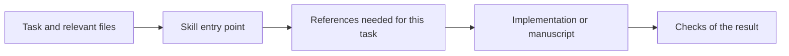

# Workflow skills

Four skills for Python development, repository migrations and writing from researched evidence.

| Skill | When to use it | Example request |
| --- | --- | --- |
| [Python engineering](skills/python-engineering/SKILL.md) | Implement or review Python with clear data flow, resource ownership and meaningful tests. | “Add a retry policy to this client and check failure behavior.” |
| [Repository refactoring](skills/repository-refactoring/SKILL.md) | Extract packages or change architecture while preserving required behavior and callers. | “Extract this pipeline into a package; keep the existing command line working.” |
| [White-paper writing](skills/white-paper-writing/SKILL.md) | Explain R&D to engineers who need the method, evidence and limitations. | “Turn these experiment notes into a technical paper with a PDF.” |
| [Executive-brief writing](skills/executive-brief-writing/SKILL.md) | Explain research on any topic to executives who need the answer, consequences and choices. | “Summarize these findings and the decision they support.” |

## Use a skill

Copy the selected folder into your agent's supported skills directory, keeping its references, scripts and assets together. Invoke it by name, for example `$python-engineering`, and give it the task and relevant files. Repository conventions and your instructions take precedence.

The Python skill handles local implementation and design. For an extraction or migration, use the refactoring skill to account for callers and capabilities as well. The two writing skills serve different readers; use the technical paper when someone needs to inspect the method and the brief when they need the conclusion and its consequences.

Most of the detail stays outside the entry point:



The [design note](docs/design.md) explains this arrangement, how work is delegated and when a capability record earns its upkeep.

## Writing helpers

Managed writing projects need Python 3.10+ and Pandoc. PDF output also needs a supported TeX engine. A short executive update can be drafted directly; ordinary managed papers use a reader brief, document plan and evidence records. A dependency graph is available when coordination or repeated impact queries justify it.

```bash
python3 skills/white-paper-writing/scripts/init_report_project.py paper \
  --title "Experiment results" --formats pdf
python3 skills/white-paper-writing/scripts/validate_report_project.py paper
```

Initialization creates a working project, not a finished paper. After writing and checking its claims, use `build_report.py` to produce the requested output. Inspect that output and record actual reviews before running release validation. The scripts check structure and freshness; reviewers assess whether the claims and explanation hold up.

## Examples and checks

Each writing skill produced a PDF about its own design, supporting rationale and limits:

| Sample | What it covers | Reading length |
| --- | --- | --- |
| [White-paper writing — PDF](examples/white-paper/output/report.pdf) | A technical explanation for engineers: evidence records, bounded AI tasks, separate quality checks and four concrete failure audits. Cites writing guidance, Anthropic's AI workflow guidance and ALCE citation research. | Two main pages plus references |
| [Executive-brief writing — PDF](examples/executive-brief/output/report.pdf) | A concise overview for executives of briefs on any topic requiring researched evidence. Explains reader fit, source support and three reviewer checks, with a hypothetical supplier example. Cites writing guidance and ALCE research. | One main page plus references |

Inspect the [white-paper manuscript](examples/white-paper/report.md) or [executive manuscript](examples/executive-brief/report.md). Each [technical sample project](examples/white-paper) and [executive sample project](examples/executive-brief) includes source records, selective external extracts, build metadata and actual evidence, editorial, fresh agent reader and rendered-page reviews.

The PDFs were refreshed on 2026-10-09. They distinguish design rationale from the limited earlier agent-based comparison; neither sample establishes general writing improvement or intended-human-reader benefit.

The refactoring reference includes a [runnable package-extraction example](skills/repository-refactoring/assets/package-extraction/CAPABILITY_COMPARISON.md).

For the helper tests and example release checks, see [verification](docs/verification.md). The [evaluation note](docs/evaluation.md) covers the observed failures, corrections and limits. Tests and agent reviews support the specific cases described there; intended human-reader benefit and general improvements remain open questions.

## License

A reuse license has not been selected for this review version.
