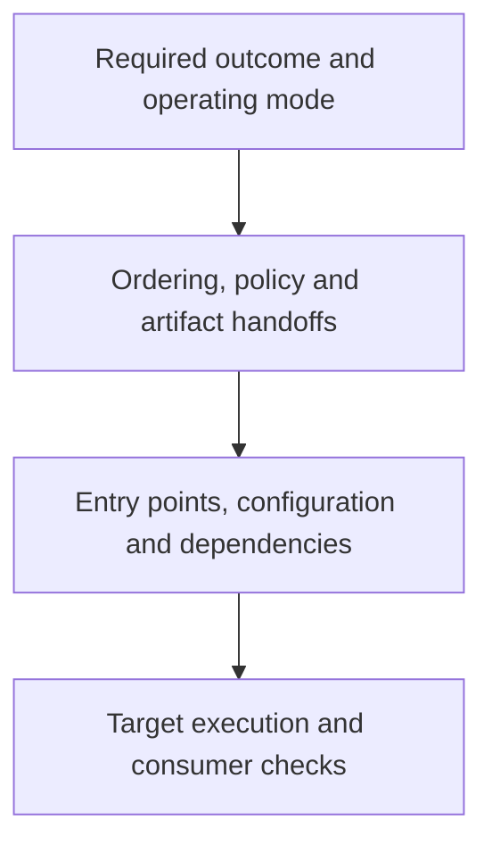

# Design choices

## Keep the first read small

Each skill starts with the decisions needed for its task. Longer references cover conditional work: resource lifecycles, behavioral verification, migration records, research and document production. The agent reads them when they are relevant. This is progressive disclosure: keep useful detail available without putting every procedure into every task's context.

Context still needs source evidence. A short instruction file cannot replace the caller, operating contract or source passage that determines the answer.

## Keep global decisions in one place

The main agent owns scope, policy, interfaces and integration. A worker can implement a settled pure function, investigate a bounded question or independently challenge a test contract. Its handoff includes changed paths, observed checks, retrievable evidence and unresolved questions. The main agent opens decisive evidence before accepting the result.

This division reduces repeated setup and conflicting decisions when work can be separated cleanly. Small or tightly coupled tasks can stay with one agent. There is no measured cache or cost advantage claimed here.

## Choose Python constructs by responsibility

Use functions for stateless transformations, domain values for meaningful data and classes for owned resources or evolving state. Compose dependencies where they are selected. Separate calculation from external effects when doing so makes the data flow easier to follow.

A protocol helps when a consumer needs a replaceable capability. A concrete dependency can remain concrete. The goal is a common path a reader can explain, including failures and ownership.

## Audit behavior across a migration

Git identifies the baseline and records source changes. A migration also needs to connect required outcomes to their behavior and implementation:

An extraction can preserve imports while ignoring an operator's changed live configuration. The migration record gives that behavior an owner and a place to verify it. For a bounded extraction, a capability table and flow notes may suffice. Structured graphs become useful when repeated impact queries, many owners or cross-session work make the mapping difficult to maintain.

Keep one authoritative mapping and use diagrams as views. Source identity and declared edges do not establish parity; check the important flows through actual entry points and consumers.

## Give writing evidence and a reading order

The evidence records locate support for consequential claims. The document plan decides when the reader encounters those claims and what they need to understand first. Technical papers retain methods and mechanisms; executive briefs bring consequences forward while keeping decision-changing caveats in the main path.

The prose pass edits a located reading problem in paragraph context. A delayed verb, several new concepts or a missing connection can justify an edit. The editor preserves definitions, attribution, uncertainty and operational detail. The passage comparison caught a real overcompression: shorter technical sentences had lost useful specificity, which was restored in the final paper.

Review records belong to the delivered version. A changed tracked source or output makes old records stale. Fingerprints help detect that condition; actual evidence review, fresh reading and rendered-page inspection supply the judgments.
